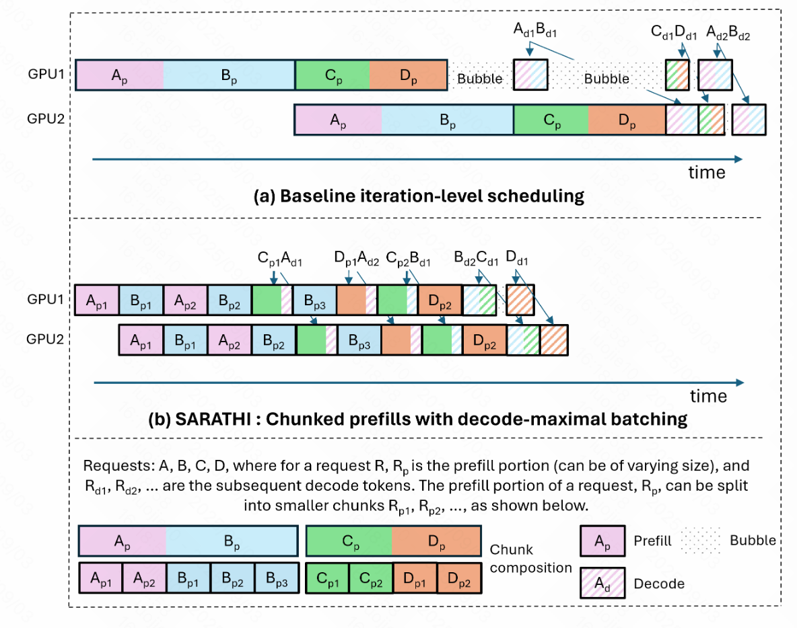
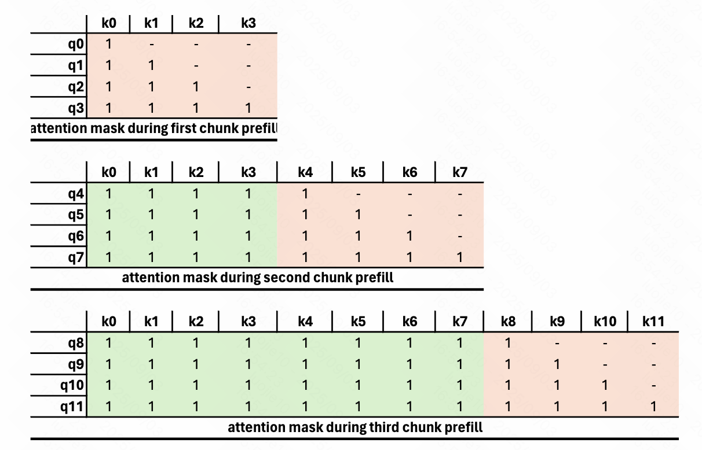

# [SARATHI: Efficient LLM Inference by Piggybacking Decodes with Chunked Prefills](https://arxiv.org/pdf/2308.16369)

## 动机

LLM 的 profill 和 decoding 两个阶段的计算特性不同。

Orca 提出的 continuous batching (iteration-level schedule)，PP 时，有很大 bubble。

由于有 KV cache 的 memory footprint 问题，decoding 阶段不太可能达到 compute bound。

PP 的 bubble 在 training 的时候，由于需要等待 backward，只能 micro-batch mitigate；

在 inference 阶段，事实上可以缓解得更好。

- 不同 Prefill 的长度不同，使得不同 iteration 计算强度不同
- 一个 request 只有一次 prefill，让 decoding 的时候，GPU 利用率不够，memory bound

## 贡献

- 提出 chunked-prefill 让每个 micro-batch 的计算恒定，减少 PP 的 bubble
- 提出 decode-maximal batching，在 chunked-prefill 把 prefill 切成更多的小块后，让 decoding 用 piggyback，形成 hybrid batch，提升 GPU 的计算利用率
- 总的效果上，提高 GPU 的吞吐量做法

## 分析

PP bubble 的几种成因：

1. prefill 长度不同
2. prefill 和 decoding 的计算耗时不同（不采用 hybrid batch 时）
3. decoding 的不同 kv 上下文长度，导致 decoding 用时不同

长尾 decoding。

构建相同计算强度的 batch。

## 方法

切了 chunked-prefill 后，需要重新设计 attention mask。

因为进行切分，原本只需要一次的 memory access，会需要反复读取，但是由实验中看出，attn 占比不大，所以是可接受的。

为了更好地执行 hybrid batch，fuse 线性计算。

hybrid batch 中，prefill 载入的模型参数被 decoding 复用（原本 decoding 主要时间在于载入模型，因为 token 很少）

确定 chunk size：通过在给定的 **model-hardware 组合** 和 **workload**，一次 profile。

prefill 效率 和 piggyback decoding 数量的 trade-off。

由于 tile 填充产生的浪费（tile size | (prefill chunk size + piggybacked decode)）

P : D = C/(B − 1)，C 是 Chucked size，B 是 decoding batch size。

但这只是基本的估计，实际还会和硬件、模型特征等相关。

## 不足

因为是先看了 PD 分离，再看这篇论文，同时参考 PD 分离提到的问题，说一说。

- chunked-prefill 的大小不定，论文中也提到 P:D 比率的估计
- 现实中更大跨度的 seq_len 的效果有待商榷
- 评价标准是 Throughout，和大部分应用场景所要求的的 SLO （PD 分离那篇论文提到）其实是有偏差的
